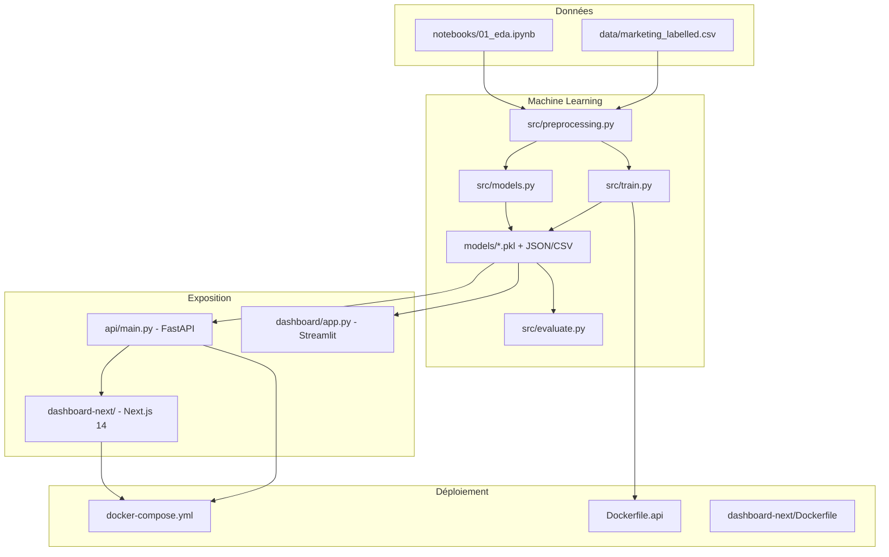

# Documentation du projet — Optimisation du ROI marketing

**EFREI Paris — Master 1 Data Engineering — RNCP40875**  
**Auteurs :** LE Quang Dat · Adrien CHUEMBOU MBAH  
**Sujet :** Projet 3 — Système intelligent multi-modèles (Marketing ROI)  
**Année :** 2025–2026

Ce document décrit **l’ensemble du travail réalisé** dans le dépôt : contexte pédagogique, architecture, pipelines ML, interfaces, déploiement et lien avec les exigences du sujet (`Projet_M1_DE_Sujet3_Marketing_ROI.md`).

---

## Table des matières

1. [Contexte et objectifs](#1-contexte-et-objectifs)
2. [Synthèse de ce qui a été réalisé](#2-synthèse-de-ce-qui-a-été-réalisé)
3. [Données et préparation (EF1)](#3-données-et-préparation-ef1)
4. [Modélisation (EF2)](#4-modélisation-ef2)
5. [Évaluation et interprétabilité (EF3)](#5-évaluation-et-interprétabilité-ef3)
6. [Interfaces utilisateur (EF4)](#6-interfaces-utilisateur-ef4)
7. [API REST (EF5)](#7-api-rest-ef5)
8. [Industrialisation Docker](#8-industrialisation-docker)
9. [Organisation du code](#9-organisation-du-code)
10. [Résultats obtenus](#10-résultats-obtenus)
11. [Choix techniques et limites](#11-choix-techniques-et-limites)
12. [Comment exécuter le projet](#12-comment-exécuter-le-projet)

---

## 1. Contexte et objectifs

Le sujet EFREI demande un **MVP end-to-end** pour optimiser le retour sur investissement (ROI) des campagnes publicitaires multi-canaux :

- **Canaux :** TV, Radio, Social Media, plus le niveau d’influenceur (Mega / Macro / Micro / Nano).
- **Cible principale :** prédire les **ventes** (`Sales`) à partir des budgets — **régression**.
- **Bonus réalisé :** **classification** des campagnes en performance Low / Medium / High (`perf_class`).
- **Exigences clés :** au moins **4 modèles** comparés, dont un **réseau de neurones (MLP)**, **dashboard interactif**, **interprétabilité** (importance des variables, SHAP optionnel), **pas de data leakage** (pipelines scikit-learn), **API REST** (optionnelle mais implémentée).

Le projet dépasse le minimum en proposant **deux stacks complémentaires** :

| Stack | Rôle | Entrée d’entraînement |
|-------|------|------------------------|
| **Streamlit** | Rapport interactif, EDA, classification, optimisation inverse | `python src/models.py` ou `python main.py` |
| **FastAPI + Next.js** | Service de prédiction + dashboard web moderne | `python src/train.py` |

Les deux stacks partagent le même module de prétraitement (`src/preprocessing.py`) pour garantir des transformations cohérentes.

---

## 2. Synthèse de ce qui a été réalisé



**Livrables concrets dans le dépôt :**

| Domaine | Réalisations |
|---------|----------------|
| Données | Chargement, labellisation `perf_class`, nettoyage implicite via pipelines |
| ML régression | 4 modèles + tuning (RandomizedSearchCV) pour RF, GB, MLP |
| ML classification | 4 modèles (logistique, RF, GB, MLP) + label encoder |
| Évaluation | Métriques test + CV, figures PNG, CSV de métriques, SHAP en option |
| Streamlit | 6 onglets dont simulateur budgétaire et **Target Planner** (optimisation SLSQP) |
| FastAPI | 6 endpoints, chargement des modèles au démarrage, cache métriques |
| Next.js | 4 pages (Overview, Models, Simulator, Insights) + proxy API |
| Ops | Docker Compose (API :8000, web :3000), entraînement intégré à l’image API |
| Orchestration | `main.py` — menu CLI train → evaluate → dashboard |

---

## 3. Données et préparation (EF1)

### 3.1 Sources

| Fichier | Usage |
|---------|--------|
| `data/Dummy Data HSS.csv` | Jeu source Kaggle (~4 572 lignes après traitement) |
| `data/marketing_and_sales.csv` | Intermédiaire |
| `data/marketing_labelled.csv` | **Fichier principal** — inclut `perf_class` |

**Source Kaggle :** [Dummy Advertising and Sales Data](https://www.kaggle.com/datasets/harrimansaragih/dummy-advertising-and-sales-data)

### 3.2 Variables

| Variable | Type | Description |
|----------|------|-------------|
| `TV`, `Radio`, `Social Media` | Numériques | Budgets en millions |
| `Influencer` | Catégorielle | Mega, Macro, Micro, Nano |
| `Sales` | Cible régression | Ventes générées |
| `perf_class` | Cible classification | Low / Medium / High (quantiles 33 % / 66 %) |

Si `perf_class` est absent du CSV, il est **recréé automatiquement** dans `load_data()` via `pd.cut` sur les quantiles de `Sales`.

### 3.3 Pipeline de prétraitement (`src/preprocessing.py`)

Un `ColumnTransformer` sklearn encapsule toutes les transformations **sans fuite** (ajustement uniquement sur le train lors de l’entraînement) :

- **Numériques** (`TV`, `Radio`, `Social Media`) : imputation médiane + `StandardScaler`
- **Catégorielles** (`Influencer`) : imputation mode + `OneHotEncoder` (drop-first, `handle_unknown="ignore"`)

Fonctions exposées :

- `load_data()` — chargement + labellisation si besoin
- `build_preprocessor()` / `build_pipeline(model)` — pipelines réutilisables
- `split_data()` — séparation train/test (`random_state=42`)
- `get_feature_names()` — noms après encodage (pour importance et SHAP)

### 3.4 Analyse exploratoire

- **Notebook :** `notebooks/01_eda.ipynb` — distributions, corrélations, cohérence des budgets
- **Streamlit — onglet Data Overview :** statistiques, histogrammes, heatmap de corrélation
- **API `/stats` + page Next.js Overview :** KPI agrégés, ROI par influenceur, répartition des ventes

---

## 4. Modélisation (EF2)

Deux scripts d’entraînement coexistent ; ils répondent à des besoins différents mais utilisent les **mêmes features** et le **même préprocesseur conceptuel**.

### 4.1 Pipeline FastAPI — `src/train.py`

**Objectif :** produire des **pipelines sklearn complets** (préprocesseur + modèle) sérialisés pour l’API.

| Clé modèle | Algorithme | Tuning |
|------------|------------|--------|
| `linear_regression` | Régression linéaire | Fit direct |
| `random_forest` | Random Forest | RandomizedSearchCV (15 iter, 5 folds) |
| `gradient_boosting` | XGBoost si disponible, sinon `GradientBoostingRegressor` | RandomizedSearchCV |
| `mlp` | MLPRegressor (64→32, early stopping) | RandomizedSearchCV |

**Artefacts générés :**

- `models/{nom}.pkl` — pipeline entier
- `models/splits.pkl` — indices train/test exacts (contrat avec `evaluate.py`)
- `models/model_list.json` — ordre de chargement API
- `models/cv_results.json` — R² moyen ± écart-type en CV

### 4.2 Pipeline Streamlit — `src/models.py`

**Objectif :** entraîner **régression et classification** avec préprocesseurs séparés (`pipeline_regression.pkl`, `pipeline_classification.pkl`).

**Régression (4 modèles) :** Linear Regression, Random Forest, Gradient Boosting (XGBoost ou sklearn), MLP.

**Classification (4 modèles) :** Logistic Regression, Random Forest, Gradient Boosting, MLP — cible `perf_class` encodée via `label_encoder.pkl`.

Hyperparamètres : `TUNE_ITER = 15`, `CV_FOLDS = 5` (compromis temps / performance documenté dans le code).

### 4.3 Deep Learning (MLP)

Le **MLP** est obligatoire au sujet ; il est intégré dans les deux tâches avec :

- Couches cachées, activation ReLU, solver Adam
- Early stopping et fraction de validation
- Comparaison explicite avec des modèles plus simples (linéaire / logistique) et des modèles à arbres

**Constat projet :** sur ce jeu synthétique très structuré, les **Random Forest et Gradient Boosting** surpassent légèrement le MLP en R² / accuracy, ce qui illustre que le DL n’est pas toujours optimal — aligné avec l’esprit du sujet.

### 4.4 Anti data leakage

Toutes les étapes d’imputation, scaling et encodage sont dans des `Pipeline` / `ColumnTransformer` sklearn, ajustés **uniquement sur X_train**. Les prédictions API et dashboard passent par les mêmes transformateurs sauvegardés.

---

## 5. Évaluation et interprétabilité (EF3)

### 5.1 Script `src/evaluate.py`

- Recharge `models/splits.pkl` pour évaluer sur le **même test set** que l’entraînement
- Calcule métriques **régression** (MAE, RMSE, R²) et **classification** (Accuracy, Precision, Recall, F1-macro, ROC-AUC)
- Cross-validation complémentaire
- Export : `models/metrics_regression.csv`, `models/metrics_classification.csv`
- Figures dans `figures/` :
  - Comparaison R² entre modèles
  - Résidus du meilleur modèle
  - Matrice de confusion (classification)
  - Importance des features (modèle à arbres)
- Option `--shap` : plots SHAP (lent, dépendance `shap`)

### 5.2 Interprétabilité exposée aux utilisateurs

| Méthode | Où |
|---------|-----|
| `feature_importances_` (arbres) | API `/feature-importance`, Streamlit, page Next.js Insights |
| Permutation importance | Streamlit (onglet Feature Importance), `evaluate.py` |
| SHAP | `evaluate.py --shap`, page Insights si figures générées |

Questions métier couvertes : contribution relative TV / Radio / Social / influenceur, comparaison des scénarios budgétaires.

### 5.3 Gestion des prédictions hors domaine (Streamlit)

Les modèles à arbres **n’extrapolent pas** au-delà des bornes d’entraînement. Si TV, Radio ou Social Media dépassent les max observés, le dashboard **bascule automatiquement** sur la régression linéaire (`effective_reg_model()` dans `dashboard/app.py`).

---

## 6. Interfaces utilisateur (EF4)

### 6.1 Dashboard Streamlit — `dashboard/app.py`

Interface **orientée métier** (CMO / marketing) avec **6 onglets** :

| Onglet | Fonctionnalité |
|--------|----------------|
| **Data Overview** | Statistiques, distributions, corrélations |
| **Model Comparison** | Tableaux et graphiques régression + classification |
| **Feature Importance** | Importance intrinsèque + permutation |
| **Predict** | Saisie d’une campagne, choix du modèle, prédiction ventes + classe perf |
| **Budget Simulator** | Sliders TV / Radio / Social / Influenceur, comparaison multi-modèles |
| **Target Planner** | (1) **Budget optimal** : `scipy.optimize.minimize` (SLSQP) pour atteindre une cible de ventes à coût minimal ; (2) **Analyse probabiliste** : distribution des prédictions par arbre du Random Forest → P(Sales ≥ objectif) |

Lancement : `streamlit run dashboard/app.py` ou via `python main.py` (option 4).

### 6.2 Dashboard Next.js — `dashboard-next/`

Application **Next.js 14** (App Router, TypeScript, Tailwind, Recharts, Radix UI, Framer Motion).

| Route | Contenu |
|-------|---------|
| `/` | Vue d’ensemble — KPI, ventes, budgets, ROI par influenceur |
| `/models` | Comparaison des modèles (métriques depuis `/metrics`) |
| `/simulator` | Simulateur budgétaire — appelle `POST /predict/all`, presets, bar chart comparatif |
| `/insights` | Importance des variables depuis `/feature-importance` |

**Client API :** `dashboard-next/lib/api.ts` — toutes les requêtes HTTP vers le backend.

**Proxy :** `next.config.js` redirige `/api/*` vers FastAPI (`localhost:8000` en dev, `http://api:8000` en Docker).

### 6.3 Orchestrateur CLI — `main.py`

Menu interactif :

1. Pipeline complet (train → evaluate → dashboard)
2. Entraînement seul (`src/models.py`)
3. Évaluation seul (`src/evaluate.py`)
4. Dashboard seul
5. Quitter

Vérifie la présence des artefacts avant chaque étape et propose de sauter si déjà à jour.

---

## 7. API REST (EF5)

**Fichier :** `api/main.py` — **FastAPI** avec chargement des modèles au **lifespan** (démarrage).

| Méthode | Endpoint | Description |
|---------|----------|-------------|
| GET | `/health` | État du service + modèles chargés |
| GET | `/stats` | Statistiques dataset (ventes, budgets, ROI, corrélations) |
| GET | `/metrics` | Métriques test + CV pour tous les modèles |
| GET | `/feature-importance` | Importances du meilleur modèle à arbres |
| POST | `/predict` | Prédiction avec le **meilleur** modèle (R² CV max) + ROI |
| POST | `/predict/all` | Prédictions des **4** modèles (simulateur Next.js) |

**Corps JSON exemple :**

```json
{
  "TV": 100,
  "Radio": 25,
  "Social_Media": 10,
  "Influencer": "Mega"
}
```

**Réponse `/predict` :** ventes prédites, ROI, budget total, écart vs moyenne historique, nom du modèle utilisé.

CORS ouvert pour le frontend. Documentation interactive : `/docs` (Swagger OpenAPI natif FastAPI).

---

## 8. Industrialisation Docker

### 8.1 `Dockerfile.api`

- Image de base **Mambaforge** (conda-forge)
- Environnement reproductible via `environment.api.yml` (Python 3.11, scikit-learn, xgboost, fastapi, uvicorn, etc.)
- Copie `src/`, `data/`, `api/`
- **`RUN python src/train.py`** pendant le build → modèles **inclus dans l’image**
- Healthcheck sur `/health`
- Commande : `uvicorn api.main:app --host 0.0.0.0 --port 8000`

### 8.2 `dashboard-next/Dockerfile`

Build multi-stage Node : build Next.js avec `API_URL` pointant vers le service `api`, puis image de production légère.

### 8.3 `docker-compose.yml`

| Service | Port | Dépendances |
|---------|------|-------------|
| `api` | 8000 | Healthcheck avant le web |
| `web` | 3000 | `depends_on: api` (healthy) |

Commande : `docker-compose up --build`

> Reconstruire l’image API **réentraîne** tous les modèles depuis les données embarquées.

---

## 9. Organisation du code

```
.
├── data/                    # Jeux CSV
├── notebooks/01_eda.ipynb   # EDA
├── src/
│   ├── preprocessing.py     # Partagé — features, pipelines, split
│   ├── train.py             # Entraînement stack FastAPI
│   ├── models.py            # Entraînement stack Streamlit (reg + clf)
│   ├── evaluate.py          # Métriques + figures + SHAP
│   └── utils.py             # ROI, options influenceur
├── models/                  # Artefacts ML (pkl, json, csv)
├── figures/                 # Sorties evaluate.py
├── api/main.py              # FastAPI
├── dashboard/app.py         # Streamlit
├── dashboard-next/          # Frontend Next.js
├── main.py                  # CLI orchestrateur
├── Dockerfile.api
├── docker-compose.yml
├── environment.api.yml      # Conda env pour Docker API
├── requirements.txt         # Dépendances Python complètes
├── requirements.api.txt     # Dépendances minimales API (pip)
├── README.md                # Guide technique (anglais)
└── Projet_M1_DE_Sujet3_Marketing_ROI.md  # Énoncé officiel
```

**Historique Git (commits principaux) :**

1. Initial commit — projet Marketing ROI complet
2. Refactorisation modules + nouvelles fonctionnalités
3. Ajustements Docker / environnement Conda

---

## 10. Résultats obtenus

### 10.1 Régression (prédiction des ventes)

| Modèle | R² (test) | CV R² (moyenne) | CV σ |
|--------|-----------|-----------------|------|
| **Random Forest** | **≈ 0,9958** | 0,9958 | 0,0018 |
| Gradient Boosting | ≈ 0,9956 | 0,9956 | 0,0019 |
| Linear Regression | ≈ 0,9950 | 0,9950 | 0,0021 |
| MLP | ≈ 0,9935 | 0,9935 | 0,0019 |

Le endpoint `/predict` sélectionne automatiquement le modèle au **meilleur R² CV** (souvent Random Forest ou Gradient Boosting).

### 10.2 Classification (Low / Medium / High)

| Modèle | Accuracy | F1-macro | ROC-AUC (macro) |
|--------|----------|----------|-----------------|
| Random Forest | ≈ 0,997 | ≈ 0,997 | ≈ 0,9998 |
| Gradient Boosting | ≈ 0,995 | ≈ 0,995 | ≈ 0,9997 |
| MLP | ≈ 0,988 | ≈ 0,988 | ≈ 0,999 |
| Logistic Regression | ≈ 0,961 | ≈ 0,961 | ≈ 0,995 |

Les scores élevés sont cohérents avec un **jeu synthétique** très régulier ; l’analyse critique (biais, risque de sur-apprentissage, généralisation) fait partie de la démarche pédagogique du sujet.

### 10.3 ROI

Le ROI exposé par l’API et les dashboards est calculé comme :

\[
\text{ROI} = \frac{\text{Sales prédites} - \text{Budget total}}{\text{Budget total}} \times 100
\]

avec `Budget total = TV + Radio + Social Media` (fonction `roi_estimate` dans `src/utils.py`).

---

## 11. Choix techniques et limites

| Choix | Justification |
|-------|----------------|
| Deux pipelines d’entraînement | Streamlit : reg + clf + optimiseur ; API : pipelines monolithiques simples à servir |
| RandomizedSearchCV plutôt que GridSearch | Compromis temps / exploration (15 combinaisons, 5 folds) |
| XGBoost avec repli sklearn | Robustesse si `xgboost` absent (Docker/local) |
| `splits.pkl` figé | Reproductibilité stricte des métriques entre train et evaluate |
| Next.js en plus de Streamlit | Dashboard « produit » + démonstration full-stack (API + SPA) |
| Données synthétiques | Excellent pour la démo ; prudence pour la généralisation en production réelle |

**Limites connues :**

- Prédictions **hors bornes d’entraînement** : arbres peu fiables → repli linéaire côté Streamlit uniquement.
- Pas de réentraînement automatique en production ; rebuild Docker ou relance manuelle de `train.py` / `models.py`.
- Classification non exposée sur tous les endpoints FastAPI (focus régression côté API publique).

---

## 12. Comment exécuter le projet

### Environnement local (développement)

```bash
# Python
pip install -r requirements.txt
python src/train.py          # Stack API
python src/evaluate.py       # Figures + métriques
uvicorn api.main:app --reload --port 8000

# Streamlit (stack complète reg + clf)
python src/models.py
python main.py               # Menu interactif
streamlit run dashboard/app.py

# Next.js
cd dashboard-next
npm install
npm run dev                  # http://localhost:3000
```

### Docker (stack complète)

```bash
docker-compose up --build
# API  → http://localhost:8000  (docs : /docs)
# Web  → http://localhost:3000
```

### Tests API rapides

```bash
curl http://localhost:8000/health
curl http://localhost:8000/metrics
curl -X POST http://localhost:8000/predict/all \
  -H "Content-Type: application/json" \
  -d '{"TV": 50, "Radio": 20, "Social_Media": 5, "Influencer": "Mega"}'
```

---

## Correspondance avec les exigences fonctionnelles

| EF | Exigence | Réalisation dans le projet |
|----|----------|---------------------------|
| **EF1** | Acquisition & préparation | `preprocessing.py`, CSV labellisé, EDA notebook + vues dashboard |
| **EF2** | ≥ 4 modèles + DL | 4 reg + 4 clf, MLP, tuning, justification par métriques |
| **EF3** | Évaluation | `evaluate.py`, CSV métriques, figures, SHAP optionnel, analyse erreurs/résidus |
| **EF4** | Dashboard interactif | Streamlit (6 onglets) + Next.js (4 pages, simulateur temps réel) |
| **EF5** | API REST | FastAPI, `/predict`, `/health`, Swagger, gestion erreurs HTTP |

---

## Documents associés

- **Guide d’utilisation technique :** [README.md](README.md)
- **Énoncé pédagogique :** [Projet_M1_DE_Sujet3_Marketing_ROI.md](Projet_M1_DE_Sujet3_Marketing_ROI.md)
- **Notes agents / dev :** [CLAUDE.md](CLAUDE.md)

---

*Projet académique EFREI — usage non commercial.*
